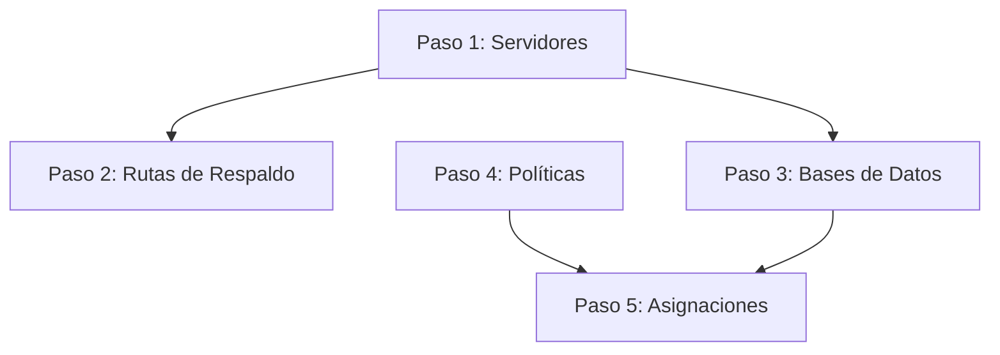

# Guía Rápida de Importación Masiva (CMDB & Backups)

Esta guía resume el proceso secuencial para realizar la carga inicial de toda tu infraestructura tecnológica y reglas de respaldo en **SGIR** mediante archivos CSV.

---

## 🗺️ El Proceso de Carga en 5 Pasos

Para garantizar que no existan errores de llaves foráneas (`FOREIGN KEY`) en la base de datos, la importación debe seguir **estrictamente** el siguiente orden. Cada paso cuenta con su guía de formato y archivo CSV de plantilla de ejemplo:

### 1️⃣ Paso 1: Servidores, Instancias y Accesos
*   **Archivo:** `01_servidores_import.csv`
*   **Guía de Formato:** [guia_formato_servidores.md](file:///home/angel/src/titulacion/sgir_backend/plantilla/guia_formato_servidores.md)
*   **Endpoint:** `POST /sgir/v1/crud/servidores/import-bulk`
*   **Qué hace:** Crea los servidores físicos, mapea discos, registra instancias DBMS (MySQL, Oracle, etc.) y encripta contraseñas (SSH/BD) de forma automática.

### 2️⃣ Paso 2: Rutas de Respaldo
*   **Archivo:** `02_rutas_import.csv`
*   **Guía de Formato:** [guia_formato_rutas.md](file:///home/angel/src/titulacion/sgir_backend/plantilla/guia_formato_rutas.md)
*   **Endpoint:** `POST /sgir/v1/crud/rutas-respaldo/import-bulk`
*   **Qué hace:** Registra las rutas de directorios físicos donde residen los dumps o archivos de backup en el host. *Requiere que la IP del servidor haya sido creada en el Paso 1.*

### 3️⃣ Paso 3: Bases de Datos y Esquemas
*   **Archivo:** `03_bases_de_datos_import.csv`
*   **Guía de Formato:** [guia_formato_bases_de_datos.md](file:///home/angel/src/titulacion/sgir_backend/plantilla/guia_formato_bases_de_datos.md)
*   **Endpoint:** `POST /sgir/v1/crud/bases-de-datos/import-bulk`
*   **Qué hace:** Detalla los esquemas lógicos y tamaños en megabytes dentro de cada motor de BD. *Requiere que la instancia DBMS haya sido creada en el Paso 1.*

### 4️⃣ Paso 4: Políticas de Respaldo
*   **Archivo:** `04_politicas_import.csv`
*   **Guía de Formato:** [guia_formato_politicas.md](file:///home/angel/src/titulacion/sgir_backend/plantilla/guia_formato_politicas.md)
*   **Endpoint:** `POST /sgir/v1/crud/politicas-respaldo/import-bulk`
*   **Qué hace:** Configura los días de retención, frecuencia horaria y planificaciones avanzadas con cron. *Es independiente de la infraestructura, requiere los catálogos base llenos.*

### 5️⃣ Paso 5: Asignación de Políticas a Bases de Datos
*   **Archivo:** `05_asignaciones_import.csv`
*   **Guía de Formato:** [guia_formato_asignaciones.md](file:///home/angel/src/titulacion/sgir_backend/plantilla/guia_formato_asignaciones.md)
*   **Endpoint:** `POST /sgir/v1/crud/asignacion-politica/import-bulk`
*   **Qué hace:** Realiza la vinculación relacional N:M de qué política de respaldo gobierna a qué base de datos lógica. *Requiere que el Paso 3 y el Paso 4 estén completados.*

---

## ⚡ Lista de Chequeo Rápida antes de Importar

*   `[ ]` **Autenticación:** Todos los endpoints `/import-bulk` requieren que envíes el Header `Authorization: Bearer <token_jwt>` de un usuario administrador activo en la plataforma.
*   `[ ]` **Codificación:** Guarda tus archivos CSV siempre en formato **UTF-8** para evitar problemas de codificación con caracteres especiales o tildes.
*   `[ ]` **Integridad de Catálogos:** Asegúrate de escribir los textos de catálogos (`Bajo`, `Medio`, `Completo`, `Local`, `MySQL`, etc.) tal cual están definidos en tus tablas maestras. El sistema es tolerante a minúsculas/mayúsculas, pero requiere concordancia exacta de palabras.
